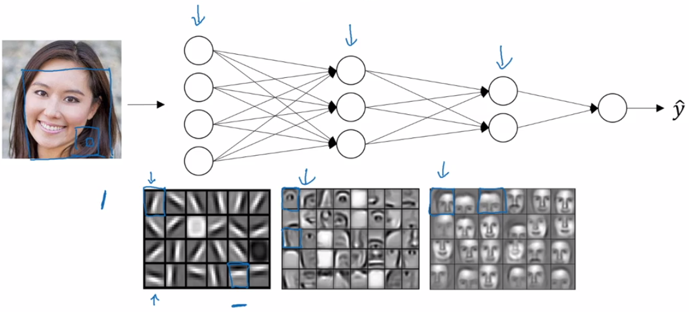
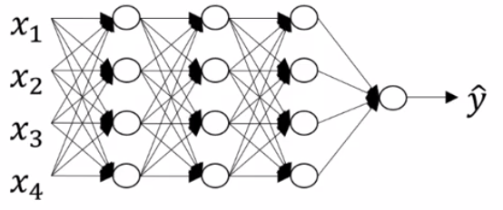
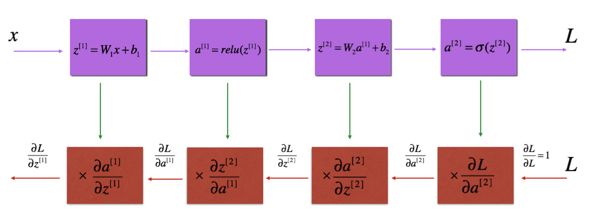

## Week 4: Deep Neural Networks

### What is a deep neural network?

A deep neural network is simply a network with more than 1 hidden layer. Compared to logistic regression or a simple neural network with one hidden layer (which are considered __shallow__ models) we say that a neural network with many hidden layers is a __deep__ model, hence the terms _deep learning / deep neural networks_.

> Shallow Vs. deep is a matter of degree, the more hidden layers, the deeper the model.

Over the years, the machine learning and AI community has realized that deep networks are excellent function approximators, and are able to learn incredibly complex functions to map inputs to outputs.

> Note that is difficult to know in advance how deep a neural network needs to be to learn an effective mapping.

#### Notation

Lets go over the notation we will need using an example network

- We will use \\(L\\) to denote the number of layers in the network (in this network \\(L=4\\))
- \\(n^{[l]}\\) denotes the number of units in layers \\(l\\) (for example, in this network \\(n^{[1]} = 5\\))
- \\(a^{[l]}\\) denotes the activations in layer \\(l\\)
- \\(W^{[l]}\\), \\(b^{[l]}\\) denotes the weights and biases for \\(z^{[l]}\\)
- \\(x = a^{[0]}\\) and \\(\hat y = a^{[L]}\\)

### Forward Propagation in a Deep Network

Forward propogation in a deep network just extends what we have already seen for forward propogation in a neural network by some number of layers. More specifically, for each layer \\(l\\) we perform the computations:

\\[ Z^{[l]} = W^{[l]}A^{[l-1]} + b^{[l]} \\]
\\[ A^{[l]} = g^{[l]}(Z^{[l]}) \\]

> Note that the above implementation is vectorized across all training examples. Matrices \\(A^{[l]}\\) and \\(Z^{[l]}\\) stacked column vectors pertaining to a single input example for layer \\(l\\).

Finally, our predictions (the results of our output layer) are:

\\[\hat Y = g(Z^{[L]}) = A^{[L]}\\]

> Note that this solution is not completely vectorized, we still need an explicit for loop over our layers \\(l = 0, 1, ..., L\\)

#### Getting your matrix dimensions right

When implementing a neural network, it is extremely important that we ensure our matrix dimensions "line up". A simple debugging tool for neural networks then, is pen and paper!

For a \\(l\\)-layered neural network, our dimensions are as follows:

- \\(W^{[l]}: (n^{[l]}, n^{[l-1]})\\)
- \\(b^{[l]}: (n^{[l]}, 1)\\)
- \\(Z^{[l]}, A^{[l]}: (n^{[l]}, m)\\)
- \\(A^{[0]} = X: (n^{[0]}, m)\\)

Where \\(n^{[l]}\\) is the number of units in layer \\(l\\).

> See [this](https://www.coursera.org/learn/neural-networks-deep-learning/lecture/Rz47X/getting-your-matrix-dimensions-right) video for a derivation of these dimensions.

When implementing backpropagation, the dimensions are the same, i.e., the dimensions of \\(W\\), \\(b\\), \\(A\\) and \\(Z\\) are the same as \\(dW\\), \\(db\\), ...

### Why deep representations?

Lets train to gain some intuition behind the success of deep representation for certain problem domains.

#### What is a deep network computing?

Lets take the example of image recognition. Perhaps you input a picture of a face, then you can think of the first layer of the neural network as an "edge detector".

The next layer can use the outputs from the previous layer, which can roughly be thought of as detected edges, and "group" them in order to detect parts of faces. Each neuron may become tuned to detect different parts of faces.

Finally, the output layer uses the output of the previous layer, detected features of a face, and compose them together to recognize a whole face.

> The main intuition is that earlier layers detect "simpler" structures, and pass this information onto the next layer which can use it to detect increasingly complex structures.

These general idea applies to other examples than just computer vision tasks (e.g., audio). Moreover, there is an analogy between deep representations in neural networks and how the brain works, however it can be dangerous to push these analogies too far.

#### Circuit theory and deep learning

Circuit theory also provides us with a possible explanation as to why deep networks work so well for some tasks. Informally, there are function you can compute with a "small" L-layer deep neural network that shallower networks require exponentially more hidden units to compute.

> Check out [this](https://www.coursera.org/learn/neural-networks-deep-learning/lecture/rz9xJ/why-deep-representations) video starting at 5:36 for a deeper explanation of this.

### Building blocks of deep neural networks

Lets take a more holistic approach and talk about all the building blocks of deep neural networks. Here is a deep neural network with a few hidden layers

Lets pick one layer, \\(l\\) and look at the computations involved.

For this layer \\(l\\), we have parameters \\(W^{[l]}\\) and \\(b^{[l]}\\). Our two major computation steps through this layer are:

__Forward Propagation__

- Input: \\(a^{[l-1]}\\)
- Output: \\(a^{[l]}\\)
- Linear function: \\(z^{[l]} = W^{[l]}a^{[l-1] + b^{[l]}}\\)
- Activation function: \\(a^{[l]} = g^{[l]}(z^{[l]})\\)

Because \\(z^{[l]}, W^{[l]}, b^{[l]}\\) are used in then backpropagation steps, it helps to cache these values during forward propagation.

__Backwards Propagation__

- Input: \\(da^{[l]}, cache(z^{[l]})\\)
- Output: \\(da^{[l-1]}, dW^{[l]}, db^{[l]}\\)

The key insight, is that for every computation in forward propagation there is a corresponding computation in backwards propagation

So one iteration of training with a neural network involves feeding our inputs into the network (\\(a^{[0]})\\), performing forward propagation computing \\(\hat y\\), and using it to compute the loss and perform backpropagation through the network. This will produce all the derivatives of the parameters w.r.t the loss that we need to update the parameters for gradient descent.

### Parameters vs hyperparameters

The __parameters__ of your model are the _adaptive_ values, \\(W\\) and \\(b\\) which are _learned_ during training via gradient descent.

In contrast, __hyperparameters__ are set before training and can be viewed as the "settings" of the learning algorithms. They have a direct effect on the eventual value of the parameters.

Examples include:

- number of iterations
- learning rate
- number of hidden layers \\(L\\)
- number of hidden units \\(n^{[1]}, n^{[2]}, ...\\)
- choice of activation function

> the learning rate is sometimes called a parameter. We will follow the convention of calling it a hyperparameter.

It can be difficult to know the optimal hyperparameters in advance. Often, we start by simply trying out many values to see what works best, this allows us to build our intuition about the best hyperparameters to use. We will defer a deep discussion on how to choose hyperparameters to the next course.

### What does this all have to do with the brain?

At the risk of giving away the punch line, _not a whole lot_.

The most important mathematical components of a neural networks: _forward propagation_ and _backwards propagation_ are rather complex, and it has been difficult to convey the intuition behind these methods. As a result, the phrase, "it's like the brain" has become an easy, but dramatically oversimplified explanation. It also helps that this explanation has caught the publics imagination.  

There is a loose analogy to be drawn from a biological neuron and the neurons in our artificial neural networks. Both take inputs (derived from other neurons) process the information and propagate a signal forward.

However, even today neuroscientists don't fully understand what a neuron is doing when it receives and propagates a signal. Indeed, we have no idea on whether the biological brain is performing some algorithmic processes similar to those performed by an ANN.

Deep learning is an excellent method for complex function approximation, i.e., learning mappings from inputs \\(x\\) to outputs \\(y\\). However we should be very wary about pushing the, "its like a brain!" analogy too far.
